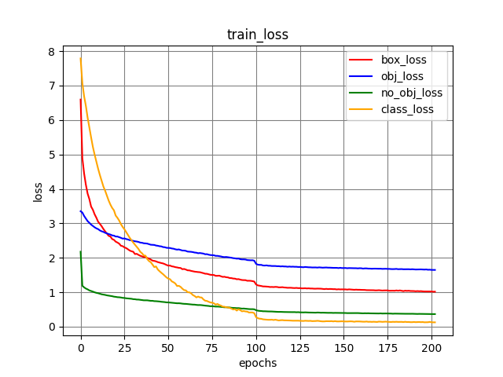

# YOLOv3
minimal implementation of [YOLOv3](https://arxiv.org/pdf/1804.02767.pdf) in pytorch. 

run the following command to start training on the default setting.
```commandline
python3 yolov3/train.py
```

## example result (y-axis is log scaled)

```commandline
mAP: 0.5328507833182812
recall: 0.5872999429702759
precision: 0.4169691205024719
```

## dataset (PASCAL VOC in YOLO format [cx, cy, w, h])
download [HERE](https://www.kaggle.com/dataset/734b7bcb7ef13a045cbdd007a3c19874c2586ed0b02b4afc86126e89d00af8d2)

or

run `download_pascal_voc.py`

## reference
original code from https://github.com/aladdinpersson/Machine-Learning-Collection/tree/master/ML/Pytorch/object_detection/YOLOv3


## TODO
- [ ] fix mAP error (current implementation introduce minor numerical error compared to torchmetric)
- [ ] add `coco.py` under `yolov3/datasets`
- [ ] more augmentation methods (e.g. [pastein](https://github.com/conradry/copy-paste-aug), mosaic, mixup, ...)
- [ ] experiment [simOTA](https://github.com/yjh0410/FreeYOLO/blob/30ca71424c965bb61917e1a9579dabd71b55c64e/models/yolo_free/matcher.py#L8)
